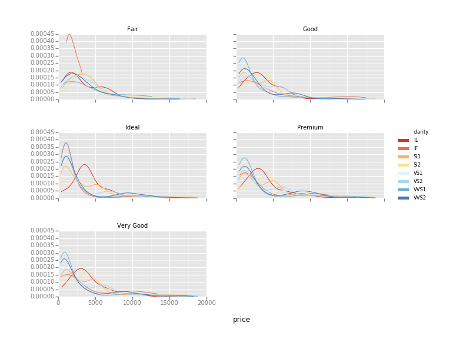

# ggplot


### What is it?
`ggplot` is the Python version of the grammar of graphics. It is not intended
to be a feature-for-feature port of [`ggplot2 for R`](https://github.com/hadley/ggplot2).
There is much greatness in `ggplot2`, the Python world could stand to benefit
from it.

You can do cool things like this:

```python
ggplot(diamonds, aes(x='price', color='clarity')) + \
    geom_density() + \
    scale_color_brewer(type='div', palette=7) + \
    facet_wrap('cut')
```


### Installation
```bash
$ pip install -U ggplot
# or
$ conda install ggplot
# or
pip install pip install git+https://github.com/yhat/ggplot.git
```

### Examples
- [gallery](./docs/Gallery.ipynb)
- [various examples](./examples.md)


### What happened to the old version that didn't work?
It's gone--the windows, the doors, [everything](https://www.youtube.com/watch?v=YuxCKv_0GZc). I deleted most of the code and
only kept what worked. The data grouping and manipulation bits were re-written
(so they actually worked) with things like facets in mind.

### Where did `stat_identity` and `geom_raster` go?
They're gone. They didn't even come close to working (also what does
  `stat_identity` even do) so they're gone.
